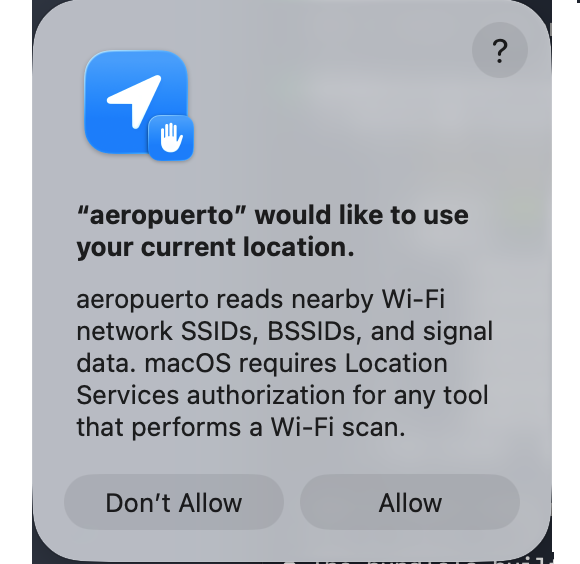

# aeropuerto

## What

`aeropuerto` is a well-intentioned tool designed to supply wireless network data for those who believe they need it.

It reads nearby Wi-Fi network details (SSID, BSSID, signal strength) and the Mac's own current Wi-Fi association.

User approval in macOS Location Services is required by Apple for any tool that performs a Wi-Fi scan.

## Requirements

- macOS 12 or later
- A Mac with Wi-Fi hardware
- To collect all available attributes with `aeropuerto`, it must be executed as the root user or with `sudo`

>`aeropuerto` uses [CoreWLAN](https://developer.apple.com/documentation/corewlan); `mcsIndex`, `guardInterval`, `spatialStreams`, `channelClearAssessment`, and `scanCacheCount` come from `wdutil`, which requires root. A plain, unprivileged `aeropuerto -I` never attempts this and these five fields are simply omitted; run with `sudo` to include them.

## Install

Download the signed, notarized `.pkg` from [Releases](https://github.com/nonpunctual/aeropuerto/releases) and run it.

Right after the installer finishes, the application will automatically launch. You should see a system prompt asking you to allow `aeropuerto` to use your location. Click 'Allow' to enable it (SSID/SSID data/BSSID/country code stay redacted otherwise). The first launch checks the current Wi-Fi interface. It doesn't scan for nearby networks.



If you don't see the prompt, or want to grant access later, go to:

&nbsp;&nbsp;&nbsp;&nbsp;System Settings > Privacy & Security > Location Services and enable `aeropuerto` there.

After granting Location Services access to the application, it never has to be opened again. It can be used purely as a command-line (CLI) tool. The installer creates a symlink from the binary:

  `/Applications/Utilities/aeropuerto.app/Contents/MacOS/aeropuerto`

to

  `/usr/local/bin/aeropuerto`

meaning it can be called like any other CLI tool with just its name in Terminal.app, e.g.,

  `% aeropuerto`

## Help

Loosely based on deprecated macOS binary function...

Running `aeropuerto` with no flags (or `-h`/`--help`) prints this usage message. 
```
Usage: aeropuerto -s [-interface <interface>]
       aeropuerto -I [-interface <interface>]

  -s   Scan for nearby Wi-Fi networks, print a JSON array.
  -I   Print CoreWLAN attributes as a JSON array: one object per Wi-Fi
       interface present (on or off) by default, or just the named one
       with -interface.
  -interface <interface>
       Target a specific Wi-Fi interface (e.g. en0) with -s or -I,
       instead of -s's single default interface or -I's default of
       every interface present.
```

The binary writes `JSON` to `stdout` so any of your favorite tools for parsing & collecting the data should work.

`aeropuerto -s` prints an array of nearby networks:

```sh
% aeropuerto -s | jq '[.[] | {ssid, bssid, channelNumber}]'
[
  {
    "ssid": "Alice",
    "bssid": "c1:42:d3:64:7a:df",
    "channelNumber": 1
  },
  {
    "ssid": "Bob",
    "bssid": "a6:bf:c5:d5:ee:fa",
    "channelNumber": 44
  },
  {
    "ssid": "Chuck",
    "bssid": "1a:d2:3e:4c:53:6a",
    "channelNumber": 157
  },
  {
    "ssid": "Dave",
    "bssid": "f4:fe:8d:3c:3b:9a",
    "channelNumber": 6
  },
  {
    "ssid": "Emily",
    "bssid": "54:75:76:47:08:b9",
    "channelNumber": 11
  }
]
```

```sh
% aeropuerto -s | jq -r '.[].ssid'
SomeDudePA
Chad's Wi-fi
FBI
xfinitywifi
Verizon_XYZ123
Fios-9876
```

`aeropuerto -I` prints a JSON array with one object per Wi-Fi interface present on the Mac (on or off), each describing that interface's own current association. Most Macs have exactly one Wi-Fi interface (`en0`), so the array normally has one element; a USB Wi-Fi adapter would add a second.

```sh
% aeropuerto -I
[
  {
    "interfaceName": "en0",
    "powerOn": true,
    "serviceActive": true,
    "ssid": "Example Network",
    "ssidData": "4578616d706c65204e6574776f726b",
    "bssid": "aa:bb:cc:dd:ee:fz",
    "rssi": -48,
    "noise": -96,
    "channelNumber": 157,
    "channelBand": "5GHz",
    "channelWidth": "80MHz",
    "security": "WPA2 Personal",
    "hardwareAddress": "a0:b7:cb:d1:e1:za",
    "activePHYMode": "802.11ac",
    "transmitRate": 866,
    "transmitPower": 18,
    "countryCode": "US",
    "interfaceMode": "station",
    "supportedWLANChannels": [
      {"channelNumber": 1, "channelBand": "2.4GHz", "channelWidth": "20MHz"}
    ],
    "configuration": {
      "networkProfiles": [
        {"ssid": "Example Network", "security": "WPA2 Personal"},
        {"ssid": "Neighbor's Wifi", "security": "Open"}
      ],
      "rememberJoinedNetworks": true,
      "requireAdministratorForAssociation": false,
      "requireAdministratorForPower": false,
      "requireAdministratorForIBSSMode": false
    },
    "mcsIndex": 0,
    "guardInterval": 0,
    "spatialStreams": 0,
    "channelClearAssessment": 19,
    "scanCacheCount": 81
  }
]
```

## Build

```
swift build
```

or, to produce the signed `.app` bundle (required for Location Services to work; bare Mach-O executables aren't listed in System Settings):

```
./build.sh
```

This requires a Developer ID Application certificate. Edit the `signing_identity` variable in `build.sh` to use your own.

## Why

If there is a reason not to use this application, or a reason this application should not exist, I guess someone will let me know. It is not meant to supply data to bad people with bad intentions for geolocating people's private home networks.

Unfortunately, the cost of supplying this data to those with good intentions who think they need it may be the privacy of all wireless networks. Understanding that cost is important.

With or without this application, war drivers can still swing by your house & pick up what your access points are broadcasting. It's also important to understand that.

Please forgive this philosophical discussion of what ideally should be a purely technical subject. Given the state of affairs (i.e., that Apple no longer believes this data should be made easily available or expressed on the device the way it has been for years) I thought it was necessary.

Thanks & please enjoy `aeropuerto`! Feel free to leave any comments or ideas via [Issues](https://github.com/nonpunctual/aeropuerto/issues).

© 2026 [nonpunctual.org](http://nonpunctual.org) (Brock Walters)
